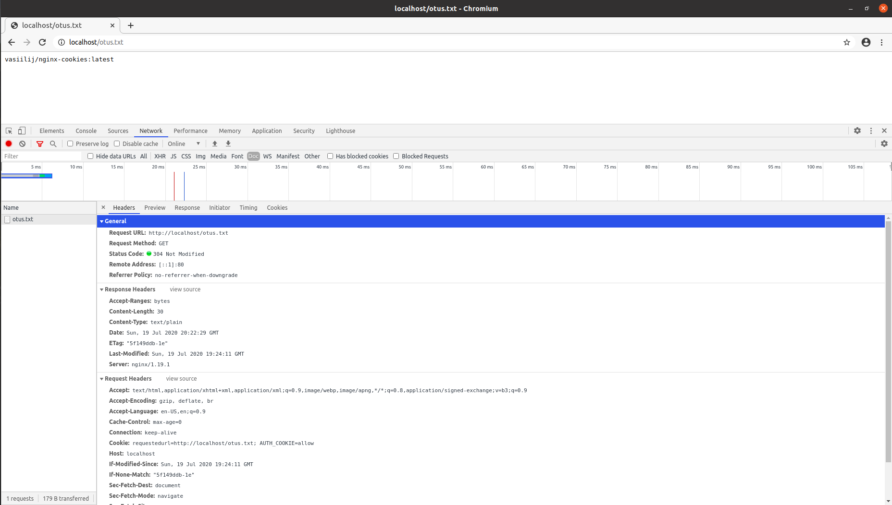

## **Задание**

***Защита от ДДОС средствами nginx***

Написать конфигурацию nginx, которая даёт доступ клиенту только с определенной cookie. Если у клиента её нет, нужно выполнить редирект на location, в котором кука будет добавлена, после чего клиент будет обратно отправлен (редирект) на запрашиваемый ресурс.

Смысл: умные боты попадаются редко, тупые боты по редиректам с куками два раза не пойдут
Для выполнения ДЗ понадобятся

https://nginx.org/ru/docs/http/ngx_http_rewrite_module.html
https://nginx.org/ru/docs/http/ngx_http_headers_module.html

## **Выполнение задания**

***В результате выполнения ДЗ реализована следующая логика обработки запроса:***

1. Приходит запрос "http://localhost/otus.txt", который обрабатывается в соответсвии с блоком `location` следующего содержания:
```
        location / {
            if ($http_cookie !~* "AUTH_COOKIE=allow") {
                #Add cookie with the requested url so as not to lose the requested url
                add_header Set-Cookie "requestedurl=$scheme://$host$request_uri";
                return 302 $scheme://$host/setauthcookie;
            }
        }
```
Здесь проверяется наличие куки `AUTH_COOKIE` со значением `allow`. Если такая кука есть, то выводится содержимое файла `otus.txt`. Если нет, то возвращается код ответа 302 с перенаправлением запроса в `location /setauthcookie`.

2. `location /setauthcookie` выглядит следующим образом:
```
        location /setauthcookie {
            #Add allowed cookie for access to requested uri
            add_header Set-Cookie "AUTH_COOKIE=allow";
            #Return to requested uri
            if ($cookie_requestedurl) {
                return 302 "$cookie_requestedurl";
            }
        }
```
Здесь в заголовок закпроса добавляется кука, с которой разрешен доступ к "http://localhost/otus.txt". После этого выполняется редирект по изначально запрошенному uri, значение которого берется из куки `requestedurl`.

## **Проверка задания**

Выполнить `docker-compose up -d`.

Пример запросов тупого бота можно осуществить curl'ом:

1. Без обработки редиректов:
   
```
vasya@moisey-nb:~$ curl -i http://localhost/otus.txt
HTTP/1.1 302 Moved Temporarily
Server: nginx/1.19.1
Date: Sun, 19 Jul 2020 20:13:41 GMT
Content-Type: text/html
Content-Length: 145
Connection: keep-alive
Location: http://localhost/setauthcookie
Set-Cookie: requestedurl=http://localhost/otus.txt

<html>
<head><title>302 Found</title></head>
<body>
<center><h1>302 Found</h1></center>
<hr><center>nginx/1.19.1</center>
</body>
</html>
```
2. С обработкой редиректов:
   
```
vasya@moisey-nb:~$ curl -iL http://localhost/otus.txt
HTTP/1.1 302 Moved Temporarily
Server: nginx/1.19.1
Date: Sun, 19 Jul 2020 20:18:48 GMT
Content-Type: text/html
Content-Length: 145
Connection: keep-alive
Location: http://localhost/setauthcookie
Set-Cookie: requestedurl=http://localhost/otus.txt

HTTP/1.1 404 Not Found
Server: nginx/1.19.1
Date: Sun, 19 Jul 2020 20:18:48 GMT
Content-Type: text/html
Content-Length: 153
Connection: keep-alive

<html>
<head><title>404 Not Found</title></head>
<body>
<center><h1>404 Not Found</h1></center>
<hr><center>nginx/1.19.1</center>
</body>
</html>
```

Видим, что запрос завершается ошибкой.

Теперь выполним запрос curl'ом с обработкой полученных куки:

```
vasya@moisey-nb:~$ curl -b /tmp/authcookie -iL http://localhost/otus.txt
HTTP/1.1 302 Moved Temporarily
Server: nginx/1.19.1
Date: Sun, 19 Jul 2020 20:21:08 GMT
Content-Type: text/html
Content-Length: 145
Connection: keep-alive
Location: http://localhost/setauthcookie
Set-Cookie: requestedurl=http://localhost/otus.txt

HTTP/1.1 302 Moved Temporarily
Server: nginx/1.19.1
Date: Sun, 19 Jul 2020 20:21:08 GMT
Content-Type: text/html
Content-Length: 145
Connection: keep-alive
Location: http://localhost/otus.txt
Set-Cookie: AUTH_COOKIE=allow

HTTP/1.1 200 OK
Server: nginx/1.19.1
Date: Sun, 19 Jul 2020 20:21:08 GMT
Content-Type: text/plain
Content-Length: 30
Last-Modified: Sun, 19 Jul 2020 19:24:11 GMT
Connection: keep-alive
ETag: "5f149ddb-1e"
Accept-Ranges: bytes

vasiilij/nginx-cookies:latest
```

Видим положительный результат с кодом ответа 200.

То же самое в браузере, который умеет обрабатывать куки и редиректы, выглядит следующим образом:

